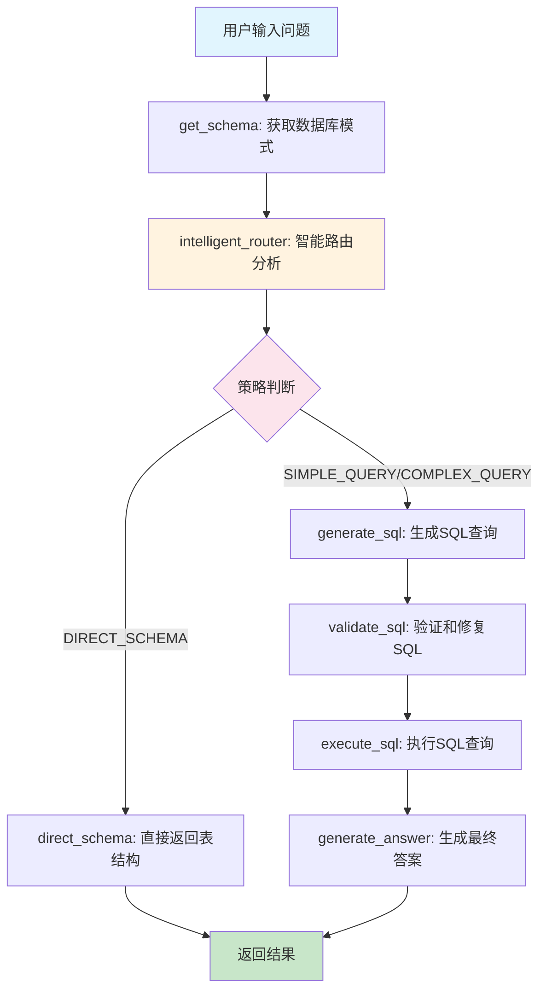

## 项目工作流总结

基于对 `/Users/zihao_/Documents/coding/Langchain_chatwithdata/W20方向/sql_agent_app.py` 的分析，该项目是一个基于 LangGraph 构建的智能 SQL 查询代理，以下是完整的工作流程：

### 核心架构
- **框架**: LangGraph (状态图工作流)
- **数据库**: DuckDB
- **多模型架构**: 
  - DeepSeek (SQL生成和验证)
  - GLM-4-Flash (意图识别和答案生成)
- **界面**: Gradio Web界面

### 工作流程图 (Mermaid)



### 详细节点功能

#### 1. **get_schema** (获取数据库模式)
- 获取数据库表结构信息
- 为后续分析提供基础数据

#### 2. **intelligent_router** (智能路由) - 核心优化节点
- **合并了原来的3个节点**: `identify_intent` + `should_plan_problem` + `plan_problem`
- **一次LLM调用完成**:
  - 意图识别 (GET_SCHEMA/EXECUTE_QUERY/GET_INFO)
  - 复杂度评估 (简单/中等/复杂)
  - 策略决策 (DIRECT_SCHEMA/SIMPLE_QUERY/COMPLEX_QUERY)
  - 规划输出 (复杂查询的规划或简单查询的无需规划)

#### 3. **route_by_strategy** (策略路由)
- 根据智能路由的策略决定下一步:
  - `DIRECT_SCHEMA` → 直接返回表结构
  - `SIMPLE_QUERY/COMPLEX_QUERY` → 生成SQL查询

#### 4. **generate_sql** (SQL生成)
- 使用 DeepSeek 模型生成SQL查询
- 支持复杂查询规划
- 包含特定场景处理指南(车型名称、百分比分布等)

#### 5. **validate_sql** (SQL验证) - 性能优化节点
- 使用**缓存的表结构**验证SQL查询
- 避免重复查询数据库获取表结构
- 提供错误修复建议

#### 6. **execute_sql** (SQL执行)
- 执行验证后的SQL查询
- 详细的错误处理和建议
- 空结果检测和标识

#### 7. **generate_answer** (答案生成)
- 使用 GLM-4 模型生成最终答案
- 处理SQL执行错误的解释
- 严格基于查询结果回答

#### 8. **direct_schema** (直接模式响应)
- 直接返回数据库结构信息
- 使用 GLM-4 生成友好的表结构描述
- 支持特定表的详细信息查询

### 关键优化特性

#### 1. **智能路由合并** (已实现)
- 将3个节点合并为1个，减少75%的LLM调用
- 从4次LLM调用减少到1次

#### 2. **表结构缓存** (已实现)
- 启动时完整缓存所有表结构
- `validate_sql`节点直接使用缓存
- 提供缓存状态监控和刷新功能

#### 3. **多模型架构**
- DeepSeek: SQL生成和验证 (专业性强)
- GLM-4: 意图识别和答案生成 (理解能力强)

#### 4. **错误处理和恢复**
- 语法错误检测
- 表/列不存在的智能建议
- 相似名称推荐

#### 5. **连接池管理**
- 全局数据库连接单例
- 避免重复创建连接

### 状态管理 (AgentState)

```python
class AgentState(TypedDict):
    question: str                    # 用户问题
    thoughts: List[str]             # 思考过程
    intent: Optional[str]           # 用户意图
    schema: Optional[str]           # 数据库模式
    complexity: Optional[str]       # 复杂度评估 (新增)
    strategy: Optional[str]         # 处理策略 (新增)
    planning_output: Optional[str]  # 规划输出 (新增)
    sql_query: Optional[str]        # SQL查询
    sql_result: Optional[str]       # 查询结果
    answer: Optional[str]           # 最终答案
    conversation_history: List[Dict[str, str]]  # 对话历史
    error: Optional[str]            # 错误信息
```

### 性能提升效果

1. **LLM调用优化**: 从原来的4-5次减少到1-2次
2. **数据库查询优化**: 表结构查询从每次验证时查询改为启动时一次性缓存
3. **响应时间**: 显著减少延迟
4. **资源消耗**: 降低API调用成本和数据库负载

### 部署和配置

- **环境配置**: 通过 `.env` 文件管理API密钥
- **LangSmith集成**: 可选的调试和跟踪功能
- **Gradio界面**: 用户友好的Web界面
- **示例查询**: 预设常用查询示例

这个项目展现了一个经过深度优化的智能SQL查询系统，通过合并节点、缓存机制和多模型架构实现了高效的自然语言到SQL的转换和执行。
        