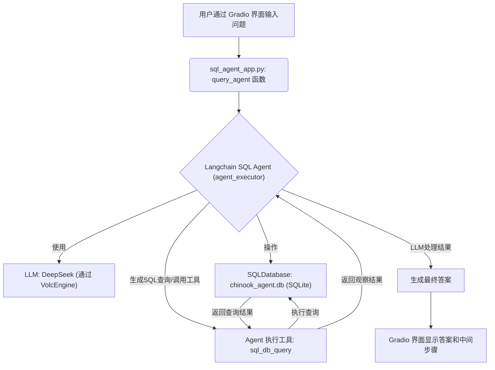
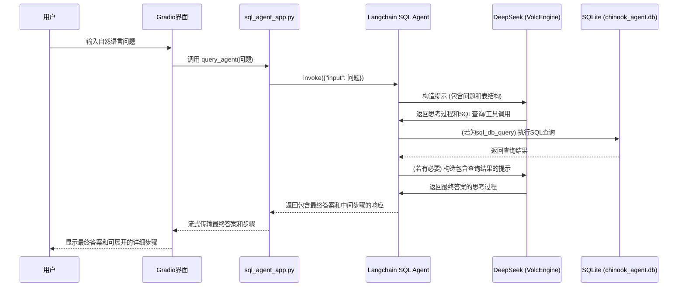

# Langchain SQL Agent 与 DeepSeek (通过 VolcEngine) 项目

本项目演示了如何使用 Langchain SQL Agent 和 DeepSeek 大型语言模型（通过 VolcEngine Ark API）与 SQLite 数据库进行交互。用户可以通过 Gradio 界面用自然语言提问，Agent 会将问题转化为 SQL 查询，在数据库中执行，并将结果以自然语言形式返回给用户。

## 主要功能

*   **自然语言查询**: 用户可以使用自然语言与 SQLite 数据库进行交互。
*   **SQL Agent**: 利用 Langchain 的 `create_sql_agent` 动态生成和执行 SQL 查询。
*   **DeepSeek LLM**: 使用强大的 DeepSeek 模型作为核心的语言理解和生成引擎。
*   **Gradio 用户界面**: 提供一个简单易用的 Web 界面进行交互。
*   **动态数据库**: 应用启动时会自动创建并填充一个示例 SQLite 数据库 (`chinook_agent.db`)。
*   **详细步骤展示**: 在界面中展示 Agent 执行的中间步骤和 SQL 查询，方便理解和调试。
*   **LangSmith 集成 (可选)**: 支持 LangSmith 进行追踪和调试。

## 目录结构

```
Langchain_chatwithdata/W20方向/
├── .env                # 环境变量配置文件 (需手动创建)
├── sql_agent_app.py    # 主要的应用脚本
├── requirements.txt    # Python 依赖包
├── chinook_agent.db    # SQLite 数据库文件 (应用运行时自动创建)
└── README.md           # 本文档
```

## 环境设置与安装

1.  **克隆仓库 (如果适用)**

    ```bash
    # git clone <repository_url>
    # cd Langchain_chatwithdata/W20方向
    ```

2.  **创建并激活 Python 虚拟环境 (推荐)**

    ```bash
    python3 -m venv venv
    source venv/bin/activate  # macOS/Linux
    # venv\Scripts\activate    # Windows
    ```

3.  **安装依赖**

    确保 `requirements.txt` 文件包含以下主要依赖 (如果项目提供了该文件，则直接使用):

    ```
    langchain
    langchain-openai
    langchain-community
    gradio
    python-dotenv
    sqlite3 # 通常是 Python 内置的
    # 根据实际使用的 langchain 版本和 deepseek 需求，可能还有其他依赖
    ```

    然后运行:
    ```bash
    pip install -r requirements.txt
    ```

4.  **配置环境变量**

    在项目根目录 (`/Users/zihao_/Documents/coding/Langchain_chatwithdata/W20方向/`) 下创建一个名为 `.env` 的文件，并填入以下内容:

    ```env
    # VolcEngine Ark API 相关
    ARK_API_KEY="YOUR_ARK_API_KEY"
    deepseek0324="YOUR_DEEPSEEK_MODEL_ENDPOINT_ID" # 例如: deepseek-chat

    # LangSmith (可选)
    ENABLE_LANGSMITH="true" # 或 "false"
    LangSmith_API_KEY="YOUR_LANGSMITH_API_KEY" # 如果 ENABLE_LANGSMITH 为 true
    LANGCHAIN_PROJECT="SQL_Agent_DeepSeek_Gradio" # LangSmith 项目名称 (可选)
    ```

    *   将 `YOUR_ARK_API_KEY` 替换为您的 VolcEngine Ark API 密钥。
    *   将 `YOUR_DEEPSEEK_MODEL_ENDPOINT_ID` 替换为您在 VolcEngine Ark 上使用的 DeepSeek 模型的 Endpoint ID。
    *   如果希望启用 LangSmith 追踪，请设置 `ENABLE_LANGSMITH="true"` 并提供 `LangSmith_API_KEY`。

## 如何运行

1.  确保您的虚拟环境已激活，并且 `.env` 文件已正确配置。
2.  在终端中，导航到项目目录 (`/Users/zihao_/Documents/coding/Langchain_chatwithdata/W20方向/`)。
3.  运行应用:

    ```bash
    python sql_agent_app.py
    ```

4.  应用启动后，终端会显示 Gradio 界面的访问地址 (通常是 `http://127.0.0.1:7860` 或类似地址)。在浏览器中打开此地址即可开始使用。

## 工作流程



## 数据流



## <u>关键技术亮点</u>

*   **<u>Langchain SQL Agent</u>**: 核心组件，实现了自然语言到 SQL 的转换、数据库查询执行以及结果的解释。它利用了 Langchain 的 Agent 框架，能够根据 LLM 的输出来决定下一步操作（查询数据库、查询表结构等）。
*   **<u>DeepSeek LLM (via VolcEngine)</u>**: 作为 Agent 的大脑，负责理解用户问题、生成 SQL 查询语句、分析查询结果并生成人类可读的回答。本项目通过 VolcEngine Ark 服务接入 DeepSeek 模型。
*   **<u>Gradio Interface</u>**: 提供了一个交互式的 Web 用户界面，使得非技术用户也能方便地使用该系统。支持聊天记录、示例问题和可折叠的详细步骤展示。
*   **<u>动态数据库设置 (`setup_database`)</u>**: 应用启动时，`setup_database` 函数会检查 `chinook_agent.db` 是否存在。如果不存在，它会自动创建一个 SQLite 数据库文件，并向其中插入示例数据（Employees 表）。这确保了开箱即用的体验。
*   **<u>LangSmith 集成 (可选)</u>**: 通过环境变量控制是否启用 LangSmith。启用后，可以方便地追踪和调试 Agent 的运行过程，观察 LLM 的输入输出、工具调用等详细信息。
*   **<u>环境变量管理 (`python-dotenv`)</u>**: 使用 `.env` 文件来管理敏感信息（如 API 密钥）和配置（如模型名称），使得配置与代码分离，提高了安全性和灵活性。
*   **<u>详细的 Agent 步骤展示</u>**: 应用不仅返回最终答案，还会将 Agent 执行的中间步骤（包括生成的 SQL 查询和数据库返回的原始结果）格式化后在 Gradio 界面中以可折叠的方式展示，增强了透明度和可调试性。
*   **<u>错误处理和提示</u>**: 对初始化失败和 Agent 调用过程中的异常进行了捕获，并向用户提供了有用的错误信息和排查建议。

## 示例问题

启动应用后，您可以尝试以下问题：

*   Describe the Employees table
*   How many employees are there in Canada?
*   Who are the employees in Calgary?
*   List all employees
*   What are the distinct countries in the Employees table?