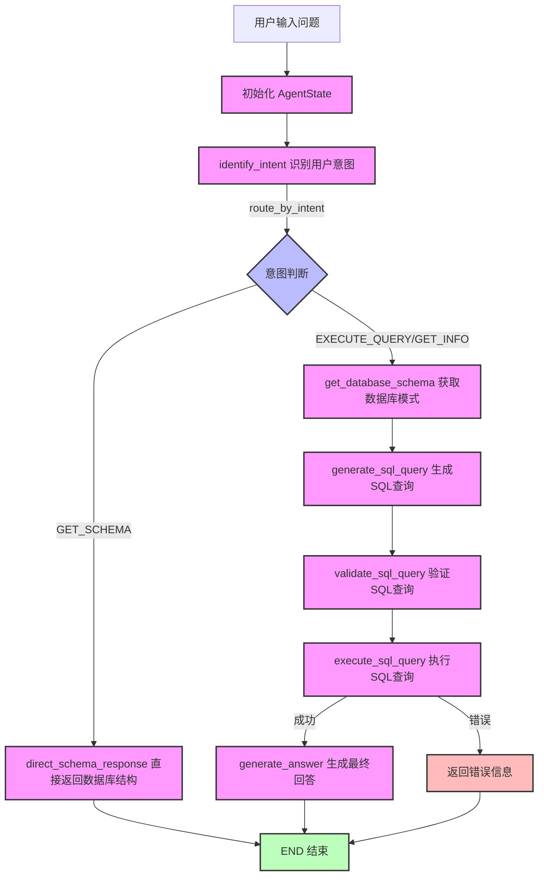
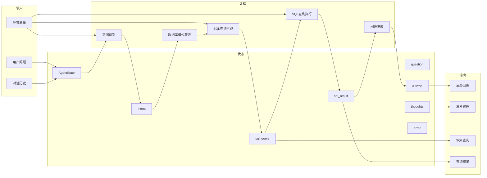

✅ LangGraph 管流程：控制流程、模块解耦、任务驱动执行
✅ MCP 给上下文：负责多轮记忆管理（Multi-round Context Provider）
✅ GPT-4o 来推理：负责自然语言理解、SQL生成、答案解释

## 工作流分析
该项目是一个基于 LangGraph 和 DeepSeek 大语言模型的 SQL 查询助手，使用 Gradio 作为界面。工作流主要包括以下步骤：

1. 初始化配置 ：加载环境变量，配置 LangSmith（可选），初始化 LLM
2. 数据库设置 ：创建或连接到 SQLite 数据库，设置示例数据
3. Agent 工作流定义 ：使用 LangGraph 创建状态图，定义节点和边
4. 用户交互 ：通过 Gradio 界面接收用户输入，调用 Agent 处理查询
5. 结果展示 ：将 Agent 处理结果以流式方式返回给用户

## 工作流程说明
1. 用户输入处理 ：
   
   - 用户通过 Gradio 界面输入问题
   - 系统初始化 AgentState 对象，包含问题、思考过程、意图等字段
2. 意图识别 ：
   
   - identify_intent 函数使用 LLM 分析用户问题，识别用户意图
   - 可能的意图包括：GET_SCHEMA（获取表结构）、EXECUTE_QUERY（执行查询）、GET_INFO（获取一般信息）
3. 路由分发 ：
   
   - route_by_intent 函数根据识别的意图决定后续流程
   - 如果是 GET_SCHEMA，直接进入 direct_schema_response 节点
   - 如果是 EXECUTE_QUERY 或 GET_INFO，进入查询流程
4. 查询流程 ：
   
   - get_database_schema 获取数据库模式信息
   - generate_sql_query 根据用户问题和数据库模式生成 SQL 查询
   - validate_sql_query 验证 SQL 查询的有效性，修复可能的问题
   - execute_sql_query 执行 SQL 查询，获取结果或错误信息
   - generate_answer 根据查询结果生成最终回答
5. 输出处理 ：
   
   - 最终回答包含：对用户问题的直接回答
   - 中间步骤（可折叠）包含：思考过程、SQL 查询、查询结果
## 关键组件
- LLM 初始化 ：使用 DeepSeek 模型，通过 VolcEngine Ark API 调用
- 数据库连接 ：使用 DuckDB，通过 SQLAlchemy 进行连接
- 状态管理 ：使用 LangGraph 的 StateGraph 管理工作流状态和转换
- 用户界面 ：使用 Gradio 构建交互式聊天界面
整个工作流程遵循 LangGraph 的状态转换模型，每个节点处理特定任务并更新状态，最终生成对用户问题的回答和相关的中间步骤信息。

## 数据流分析
数据在系统中的流动路径如下：

1. 输入数据 ：用户问题、环境变量配置、对话历史
2. 处理数据 ：意图识别、SQL 查询生成、查询执行结果
3. 输出数据 ：最终回答、中间步骤（思考过程、SQL 查询、查询结果）

