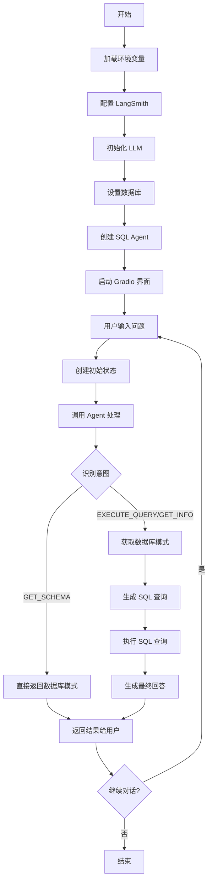
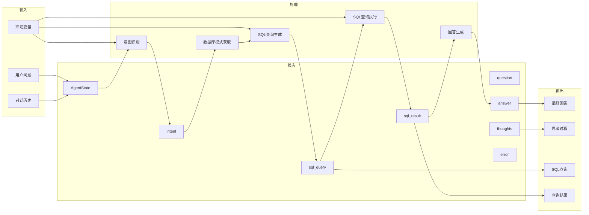

✅ LangGraph 管流程：控制流程、模块解耦、任务驱动执行
✅ MCP 给上下文：负责多轮记忆管理（Multi-round Context Provider）
✅ GPT-4o 来推理：负责自然语言理解、SQL生成、答案解释

## 工作流分析
该项目是一个基于 LangGraph 和 DeepSeek 大语言模型的 SQL 查询助手，使用 Gradio 作为界面。工作流主要包括以下步骤：

1. 初始化配置 ：加载环境变量，配置 LangSmith（可选），初始化 LLM
2. 数据库设置 ：创建或连接到 SQLite 数据库，设置示例数据
3. Agent 工作流定义 ：使用 LangGraph 创建状态图，定义节点和边
4. 用户交互 ：通过 Gradio 界面接收用户输入，调用 Agent 处理查询
5. 结果展示 ：将 Agent 处理结果以流式方式返回给用户

## 数据流分析
数据在系统中的流动路径如下：

1. 输入数据 ：用户问题、环境变量配置、对话历史
2. 处理数据 ：意图识别、SQL 查询生成、查询执行结果
3. 输出数据 ：最终回答、中间步骤（思考过程、SQL 查询、查询结果）

