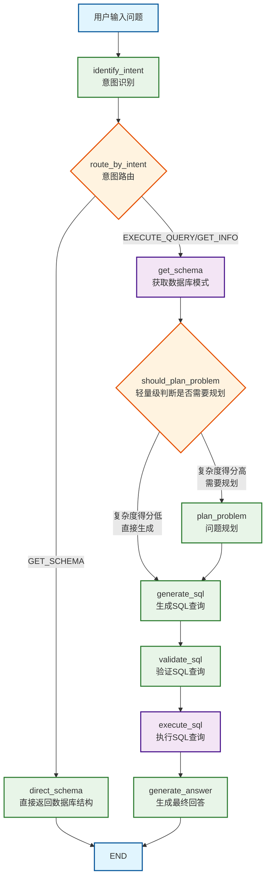

✅ LangGraph 管流程：控制流程、模块解耦、任务驱动执行
✅ MCP 给上下文：负责多轮记忆管理（Multi-round Context Provider）
✅ GPT-4o 来推理：负责自然语言理解、SQL生成、答案解释

## 工作流分析
该项目是一个基于 LangGraph 和 DeepSeek 大语言模型的 SQL 查询助手，使用 Gradio 作为界面。工作流主要包括以下步骤：

1. 初始化配置 ：加载环境变量，配置 LangSmith（可选），初始化 LLM
2. 数据库设置 ：创建或连接到 SQLite 数据库，设置示例数据
3. Agent 工作流定义 ：使用 LangGraph 创建状态图，定义节点和边
4. 用户交互 ：通过 Gradio 界面接收用户输入，调用 Agent 处理查询
5. 结果展示 ：将 Agent 处理结果以流式方式返回给用户

## 工作流程详细说明
### 1. 入口阶段
- 用户输入问题 : 用户通过 Gradio 界面输入自然语言问题
- 意图识别 : 使用 GLM-4 模型识别用户意图（GET_SCHEMA/EXECUTE_QUERY/GET_INFO）
### 2. 路由阶段
- 意图路由 : 根据识别的意图决定后续流程
  - GET_SCHEMA : 直接返回数据库结构信息
  - EXECUTE_QUERY/GET_INFO : 进入查询流程
### 3. 查询流程
- 获取数据库模式 : 获取完整的数据库结构信息
- 轻量级规划判断 : 通过多层次判断决定是否需要详细规划
  - 第一层 : 关键词快速筛选（复杂/简单关键词）
  - 第二层 : Schema复杂度分析（表数量、涉及多表）
  - 第三层 : 问题结构分析（长度、连接词）
  - 第四层 : 中等复杂度时使用快速LLM确认
### 4. SQL生成阶段
- 问题规划 （可选）: 使用 GLM-4 进行详细的查询策略规划
- SQL生成 : 使用 DeepSeek 模型根据问题和规划生成SQL查询
- SQL验证 : 使用 DeepSeek 模型验证和修复SQL查询
### 5. 执行阶段
- 执行SQL查询 : 在 DuckDB 数据库中执行查询
- 生成最终回答 : 使用 GLM-4 模型基于查询结果生成自然语言回答
## 技术架构特点
### 多模型协作
- GLM-4-Flash : 意图识别、问题规划、答案生成
- DeepSeek : SQL生成和验证
### 轻量级判断机制
- 避免不必要的LLM调用
- 基于规则的快速筛选
- 降级策略保证鲁棒性
### 错误处理
- SQL语法错误检测和修复建议
- 表名/列名不存在的智能提示
- 详细的错误分析和解决方案
### 用户体验
- 流式响应显示
- 详细的思考过程展示
- 可折叠的技术细节
- 丰富的示例问题
这个工作流程设计实现了高效的自然语言到SQL的转换，同时保持了良好的用户体验和系统鲁棒性。