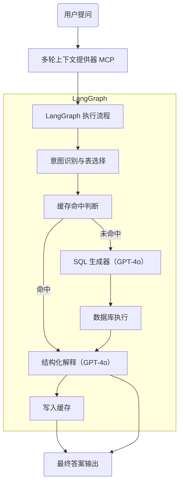

✅ LangGraph 管流程：控制流程、模块解耦、任务驱动执行

✅ MCP 给上下文：负责多轮记忆管理（Multi-round Context Provider）

✅ GPT-4o 来推理：负责自然语言理解、SQL生成、答案解释

```mermaid
flowchart TD
    Start(用户提问)
    Start --> MCP[多轮上下文提供器 MCP]
    MCP --> LangGraphFlow[LangGraph 执行流程]

    subgraph LangGraph
        Intent[意图识别与表选择]
        CacheCheck[缓存命中判断]
        SQLGen[SQL 生成器（GPT-4o）]
        ExecuteSQL[数据库执行]
        LLMAnswer[结构化解释（GPT-4o）]
        CacheWrite[写入缓存]

        LangGraphFlow --> Intent --> CacheCheck
        CacheCheck --命中--> LLMAnswer
        CacheCheck --未命中--> SQLGen --> ExecuteSQL --> LLMAnswer
        LLMAnswer --> CacheWrite
    end

    CacheWrite --> Output[最终答案输出]
    LLMAnswer --> Output
```